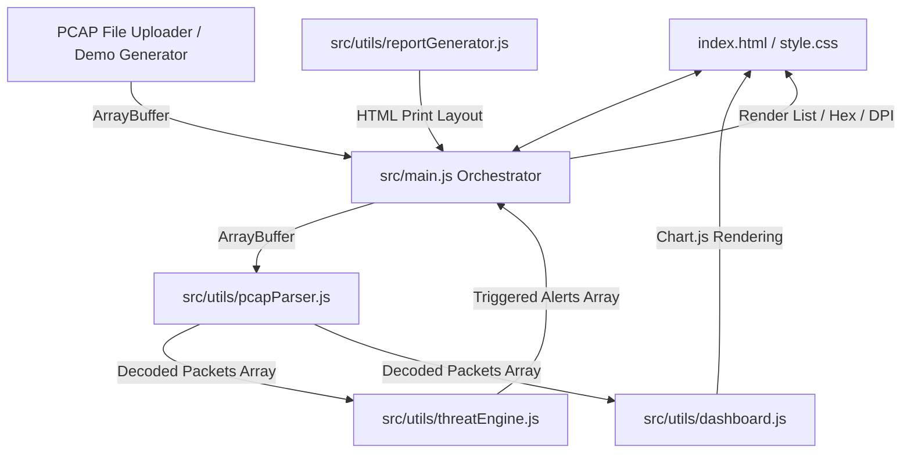

# ZITDA SentinelFlow | cPanel Cloud Traffic Forensics & Audit Console

ZITDA SentinelFlow is a lightweight, high-performance, client-side web application designed for the **Zamfara State ICT Regulatory Agency (ZITDA)**. It serves as a specialized network traffic forensics tool to audit cPanel host configurations, inspect binary packet captures (`.pcap`), detect cyber threats, and compile regulatory compliance reports conforming to Nigerian government cybersecurity frameworks.

---

## Table of Contents
1. [Core Features](#core-features)
2. [Technology Stack](#technology-stack)
3. [Architecture & Code walkthrough](#architecture--code-walkthrough)
4. [Threat Detection Capabilities](#threat-detection-capabilities)
5. [Getting Started (Local Development)](#getting-started-local-development)
6. [Deployment Guide](#deployment-guide)
7. [User Credentials Reference](#user-credentials-reference)

---

## Core Features

### 1. Secure Operator Portal
* Role-based simulated authentication for audit validation.
* Preconfigured accounts mapping to regulatory levels: **Lead Forensics Auditor**, **Security Operations Analyst**, and **External Compliance Auditor**.

### 2. Interactive Audit Dashboard
* **Real-time Statistics:** Track total packets, total network volume (Bytes/KB/MB), triggered security alerts, and an automated **ZITDA Compliance Security Score** (automatically drops based on severity of detected threats).
* **Dynamic Charting:** Visualize network capture characteristics using Chart.js:
  * **cPanel Cloud Services Protocol Distribution** (TCP, UDP, DNS, HTTP, FTP, SMTP, cPanel, WHM).
  * **Bandwidth Consumption** by State Government MDA Subdomains.
  * **Network Traffic Rate** (Packets over Time).
  * **Security Threat Category Distribution**.

### 3. Forensic Examiner (Packet Inspector)
* **Master-Detail Split Pane:** Combines a paginated, filterable packet list with double inspectors.
* **Advanced Filters:** Search and filter by keyword, IP addresses, protocols, target government MDA subdomains, and threat severity levels (Critical, Warning, Clean).
* **Deep Packet Inspection (DPI) Tree:** Decodes structured field-level details of Ethernet II, IPv4, TCP, UDP, ICMP, ARP, DNS queries/responses, and raw HTTP headers.
* **Hex & ASCII Dump Panel:** Low-level hex viewer with matching side-by-side printable ASCII payloads.
* **Threat Board Navigation Links:** Directly jumps from alert notifications to the exact packet triggering the alert.

### 4. Incident & Triage Board
* Consolidated alert logs detail security threats.
* Every alert maps to a specific state department host (MDA) and provides a **ZITDA Policy Mitigation Recommendation** for remediation.

### 5. Regulatory Report Compiler
* Compile all analyzed traffic metrics, protocol breakdowns, active alerts, and custom investigator notes into a structured audit report.
* Supports print-to-PDF styles formatted for administrative sign-off.

---

## Technology Stack
* **Frontend Structure:** Standard HTML5 with Semantic structure.
* **Styling System:** Vanilla CSS3 using custom HSL/RGB variables, dark mode aesthetics, glassmorphism card filters, responsive grid structures, and interactive animations.
* **Logic & Engine:** Pure client-side JavaScript (ES Modules syntax).
* **Visualization:** Chart.js (v4.4.2).
* **Build System:** Vite (v5).

---

## Architecture & Code Walkthrough



### File Breakdown:
1. **[index.html](file:///c:/Users/hp/OneDrive/Desktop/PROMOTION/MIT800/index.html)**: Declares the page structure, tab views, modal portal, metrics cards, table layouts, and placeholders for charts.
2. **[style.css](file:///c:/Users/hp/OneDrive/Desktop/PROMOTION/MIT800/style.css)**: Implements visual styling, layouts, animations, transitions, and media styles for A4 print-ready layouts.
3. **[src/main.js](file:///c:/Users/hp/OneDrive/Desktop/PROMOTION/MIT800/src/main.js)**: The application coordinator. Manages global state, tab routing, file upload bindings, pagination, and event listener handlers.
4. **[src/utils/pcapParser.js](file:///c:/Users/hp/OneDrive/Desktop/PROMOTION/MIT800/src/utils/pcapParser.js)**: Parses binary PCAP captures. Performs byte-level offset calculations, parses the global header (checking magic numbers for endianness and LinkType), extracts individual packet records, parses Ethernet, IPv4, TCP (including custom port detection for cPanel/WHM/Webmail/SSH), UDP, ICMP, ARP, and parses DNS request/response payloads.
5. **[src/utils/threatEngine.js](file:///c:/Users/hp/OneDrive/Desktop/PROMOTION/MIT800/src/utils/threatEngine.js)**: Evaluates packet payloads and connection flows against built-in heuristics and signatures.
6. **[src/utils/demoGenerator.js](file:///c:/Users/hp/OneDrive/Desktop/PROMOTION/MIT800/src/utils/demoGenerator.js)**: Compiles and outputs a mock binary PCAP file buffer simulating actual security incidents targeting Zamfara State departments.
7. **[src/utils/reportGenerator.js](file:///c:/Users/hp/OneDrive/Desktop/PROMOTION/MIT800/src/utils/reportGenerator.js)**: Renders the printable document template containing consolidated statistics and security findings.

---

## Threat Detection Capabilities

The threat engine ([src/utils/threatEngine.js](file:///c:/Users/hp/OneDrive/Desktop/PROMOTION/MIT800/src/utils/threatEngine.js)) implements security inspection checks based on state-level regulatory directives:

| Threat / Incident | Severity | Target Services | Logic / Heuristic |
| :--- | :--- | :--- | :--- |
| **Port Scanning** | `WARNING` | Multiple | Tracks distinct destination ports queried by a single external IP. Triggers if $\ge 5$ distinct ports are hit in the capture session. |
| **cPanel Brute Force** | `CRITICAL` | cPanel, WHM, SSH, FTP | Aggregates connection requests on administration ports (21, 22, 2082, 2083, 2086, 2087). Triggers when an external IP makes $\ge 6$ connection attempts. |
| **Cleartext FTP Credentials** | `CRITICAL` | FTP (Port 21) | Scans data payloads for cleartext commands `USER ` and `PASS ` to flag administrative authentication leakages. |
| **Unsecured cPanel Logins** | `CRITICAL` | cPanel HTTP (Port 2082) | Scans raw HTTP payloads for query/post parameters containing `user=`, `pass=`, or `password=` on unencrypted interfaces. |
| **Unencrypted Admin Channels** | `WARNING` | cPanel / WHM HTTP | Flags any admin-level traffic directed to unencrypted administrative ports (2082 or 2086). |
| **SQL Injection (SQLi)** | `CRITICAL` | HTTP Web Applications | Analyzes GET/POST HTTP strings against regex patterns matching SQL exploitation vectors (e.g., `UNION SELECT`, `OR 1=1`, `INFORMATION_SCHEMA`). |
| **Cross-Site Scripting (XSS)**| `CRITICAL` | HTTP Web Applications | Inspects HTTP request segments for script tags, event handlers (`onerror`, `onload`), inline JS protocol schemes, and cookie extraction attempts. |
| **Directory Traversal** | `CRITICAL` | HTTP Web Applications | Audits HTTP payloads for directory traversal path components (e.g., `../`, `..%2f`, `..\`) or unauthorized file access requests (e.g., `/etc/passwd`). |
| **SMTP Mail Relay (Spam)** | `CRITICAL` | SMTP (Ports 25, 465, 587) | Tracks outgoing mail handshakes originating from internal subnet hosts. Triggers when an internal host initiates $\ge 10$ distinct SMTP transmissions. |
| **ICMP Ping Flood (DDoS)** | `CRITICAL` | ICMP (Ping) | Counts incoming ICMP Echo Requests (Type 8) hitting a target host. Triggers alert on $\ge 15$ pings within the capture window. |

---

## Getting Started (Local Development)

### Prerequisites
* **Node.js** (v18 or higher recommended)
* **npm** (v9 or higher)

### Setup
1. Clone the repository:
   ```bash
   git clone https://github.com/ashirushehu2015-stack/zitda-sentinelflow.git
   cd zitda-sentinelflow
   ```
2. Install package dependencies:
   ```bash
   npm install
   ```
3. Launch the development server:
   ```bash
   npm run dev
   ```
   * Open the local address in your web browser (typically [http://localhost:5173](http://localhost:5173)).

4. Compile the project for production:
   ```bash
   npm run build
   ```
   * The optimized, built frontend assets will be generated in the `dist/` directory.

---

## Deployment Guide

### Deployment on Render (Static Site)
Because this application runs entirely client-side in the browser, it can be deployed on the **Render Free Static Site** tier without requiring any background processes or database setup:

1. Commit and push your local changes to your GitHub repository.
2. Sign in to your [Render Dashboard](https://dashboard.render.com/).
3. Click **New +** and select **Static Site**.
4. Connect and select your repository: `ashirushehu2015-stack/zitda-sentinelflow`.
5. Enter the build settings (or let Render read the auto-pushed `render.yaml` blueprint):
   * **Build Command:** `npm install; npm run build`
   * **Publish Directory:** `dist`
6. Click **Create Static Site**.

---

## User Credentials Reference
The console enforces access authorization matching roles for government networks. Use the pre-seeded operator profiles below to authenticate:

| Role / Title | Username | Access PIN / Password |
| :--- | :--- | :--- |
| **Lead Forensics Auditor** | `lead.auditor@zitda.gov.ng` | `LeadAuditor2026!` |
| **Security Operations Analyst** | `analyst@zitda.gov.ng` | `ZitdaAdmin2026!` |
| **External Compliance Auditor** | `federal.compliance@nitda.gov.ng` | `FederalAudit2026!` |

*Note: Pre-seeded credentials are encrypted for validation testing inside the main orchestrator script.*
